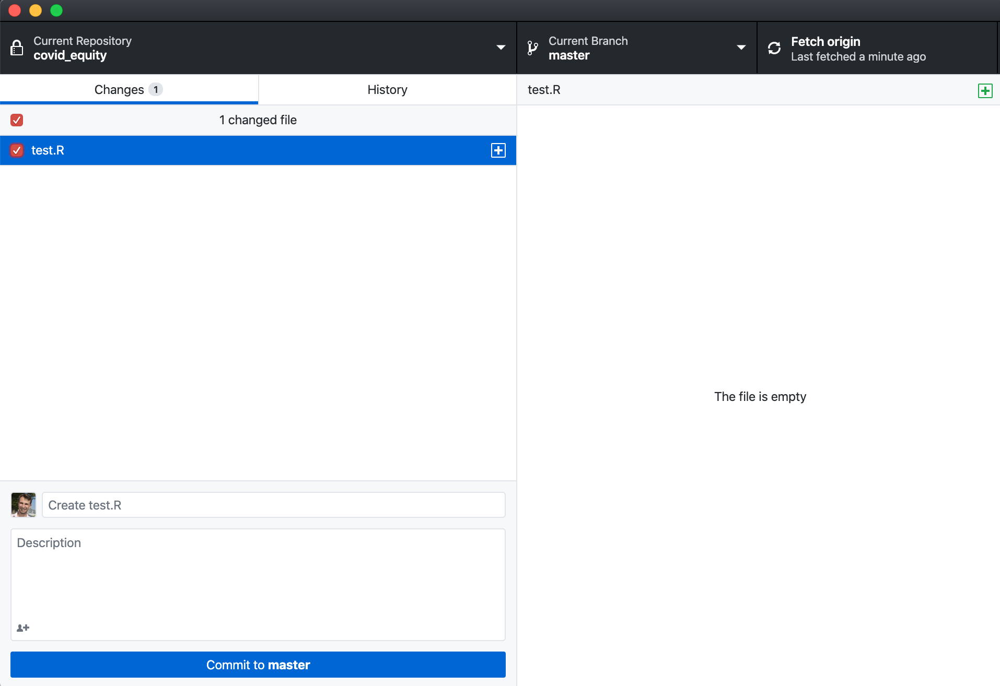

Data science is more productive and more fun when we can work on it together. R and GitHub provide a great "starter pack" for collaborative data science -- R brings the data science and GitHub brings the collaboration. In this post, we'll go over the key steps for becoming rapidly effective on a data science team that uses these tools. I'll generally be assuming that you know a bit about R -- enough to write and modify simple scripts. I won't assume that you know anything about `git` or GitHub. 

This post isn't a self-contained tutorial -- rather, it's an annotated directory to several resources that have helped me.  In many places, I'll be relying on the amazing work that Jenny Bryan and her team have put into the sites for [Stat 545](https://stat545.com/) and [Happy Git with R](https://happygitwithr.com/). 

# Getting Software

## The R Programming Language

R is available from the [Comprehensive R Archive Network](https://cran.r-project.org/). At the time of writing, the current version of R is 4.0.0. It is not generally recommended to download beta releases unless you have a specific reason to do so. If you don't already have it, install `R`. 

## RStudio

[RStudio](https://rstudio.com/) is an integrated development environment (IDE) for the R programming language. RStudio is free to use on personal hardware. RStudio makes it easy to manage files and repositories; interact with version control (see below); inspect data; view figures; and much, much more. Recommended for beginners and experts alike. If you haven't already, install RStudio. 

## Git

How can we manage complex, code-based workflows? How can we reliably share code between collaborators without syncing issues? How can we track multiple versions of scripts without going crazy? There are multiple solutions to these problems, but version control with `git` is by far the most common. It is possible to [install `git`](https://happygitwithr.com/install-git.html), but I instead suggest that beginners install GitHub Desktop (see below), which will manage `git` for you. If you are following this path, there is no need to install any software in this stage. 

## GitHub

[GitHub](https://github.com/) is an online collection of *repositories*, or collections of code. In the data science context, a repository usually corresponds to a project. GitHub makes it easy to *share* your code with others, and to work on code that others have shared. If you haven't already, make an account on GitHub. 

In fact, GitHub comes with many other amazing benefits. An especially useful one for early-career data scientists (and academics) is website hosting. A personal website is an important way to maximize the impact of your work, show off to employers, and reach colleagues. GitHub will let you host your own website, for free, by uploading plain-text documents to a special repository -- no HTML skills required. Barry Clark's website [Jekyll Now](https://www.jekyllnow.com/) gives a great starter package for getting your website up and running. 

## GitHub Desktop

While it is possible to look very cool by interacting with `git` directly in the terminal, I find it much more useful to work with a graphical program. [GitHub Desktop](https://desktop.github.com/) is my suggestion -- it's what I teach to beginners and what I use personally.  

Once you've installed GitHub Desktop, follow the prompts to log in with your GitHub username and password. 

# Basic Workflow

## Clone a Repository

<figure></img></figure>

<!-- {} -->

Your first step is to find some code to work on! In this post, I'll assume that you have been invited by your team to be a "collaborator" on the repository you'd like to work on. There are other workflows when you are not a collaborator. 

Once you've found the repository you'd like to work on, click the big green button that says "Clone or Download," and choose "Open in Desktop".

GitHub Desktop will attempt to download a copy of the files to your computer. Follow the prompts to choose a location for the files. Generally speaking, you only need to clone once per project, so we are all done with this step now. 

If you've gotten this far, you are now ready to work on your code!

## Open the Project

</img>   

<!-- {} -->

Many projects that use R and RStudio are formatted as "RStudio Projects". You can tell by the presence of an `*.Rproj` file in the repository. When an `*.RProj` file is present, **it is best to open it directly**, rather than opening a .R file or starting RStudio directly by double-clicking on its icon. There are several reasons for this, but one of the big ones is that the *.Rproj file will take care of all headaches associated with the phrase "working directory." [More on RStudio Projects](https://r4ds.had.co.nz/workflow-projects.html). 

You'll know you've opened the .Rproj file correctly if RStudio opens up and the top bar looks something like this: 


## Work on Your Code

Now you can open up any code files (like `*.R` files) and work on them. There are many resources for learning R commands and writing R code. A very good place to start is the Data Analysis I section (Chapters 5-9) on the website for [Stat 545](https://stat545.com/basic-data-care.html). A more detailed look at similar material comes in [R for Data Science](https://r4ds.had.co.nz/). If you read through the chapters and follow the examples through Part I (Explore), you'll have all the tools you need to read in some data and learn about it using R Commands. If you then make it through Part II (Wrangle), you'll be able to transform, clean, and summarize your data. Further reading will help you visualize and deploy statistical models for working with your data. 

If you're actively working on your project, go ahead and write some code. If you're just testing out your workflow with `git` and GitHub, make a new file called `test.R`. Add the following code to `test.R`. 

```r
# testing testing
print("Hello git!")
```

## Stage and Commit Your Changes

Now, navigate over to GitHub Desktop. GitHub Desktop automatically detects the new file `test.R`. 

Click the big blue "Commit" button. This button tells GitHub Desktop to "save" your changes -- the new file `test.R` is now logged in version control. 

<figure></img></figure>

## Push Your Changes

Up to this stage, you've created a new file, added some code, and committed your work to `git` through GitHub desktop. You still need to share your new work with your collaborators so that they can view your work and incorporate it into their own. For that, you need to *push* your changes to GitHub (the website). To push, just click the button that says Push Origin. 
<figure></img></figure>

The number 1 states that you have one commit -- or batch of changes -- ready to be shared. After hitting push, you have shared your new code with your team. 

## Pull the Changes of Others

<figure></img></figure>

But wait -- what if a member of your team made a change in the code while you were working? Before your push your changes, you should *pull* theirs. This will ensure that everyone is up to date and on the same page. GitHub Desktop makes it easy to pull changes. It will periodically check for changes, and the same button that you used to *push* your change can also be used to *pull* those of your teammates. 

# Basic Workflow

Let's summarize the basic workflow of a session using R and GitHub: 

1. Open GitHub Desktop and choose the repository (project) you'd like to work on.  
2. Ensure you're up to date by *pulling* the repository. 
3. Open RStudio by clicking the .RProj file associated to the project. 
4. Open the files you would like to work on. 
5. Do some coding! This is the fun part. 
6. In GitHub Desktop, *commit* your changes. 
7. In GitHub Desktop, *push* your changes. 

Working with version control can feel like a bit of a hassle, but the rewards in smooth collaborations and publicity for your projects are massive. While there are seven steps in this workflow, everything other than Step 5 -- the actual coding -- will take a minute tops. Invest the time -- you'll be happy you did. 

Happy coding! 